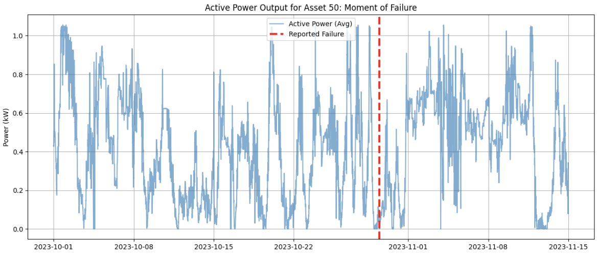

Phase 1:

Asset 50 Failure



Phase 2:

```bash
(venv) dave@155 ml-project % python3 src/features.py
Target Distribution
target
0    53137
1     2016
Name: count, dtype: int64
(venv) dave@155 ml-project % 
```